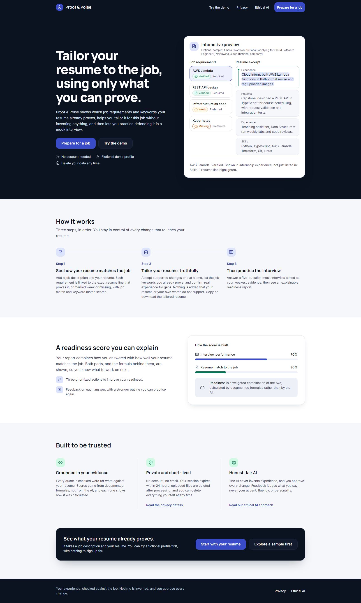
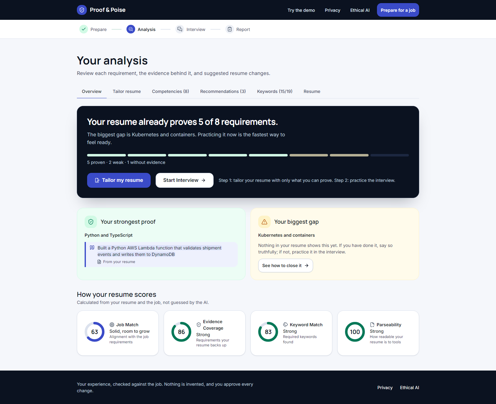
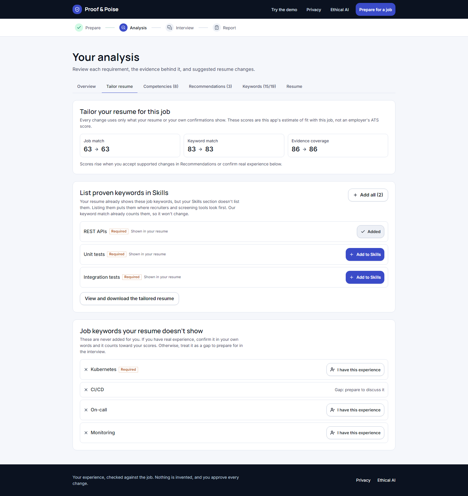
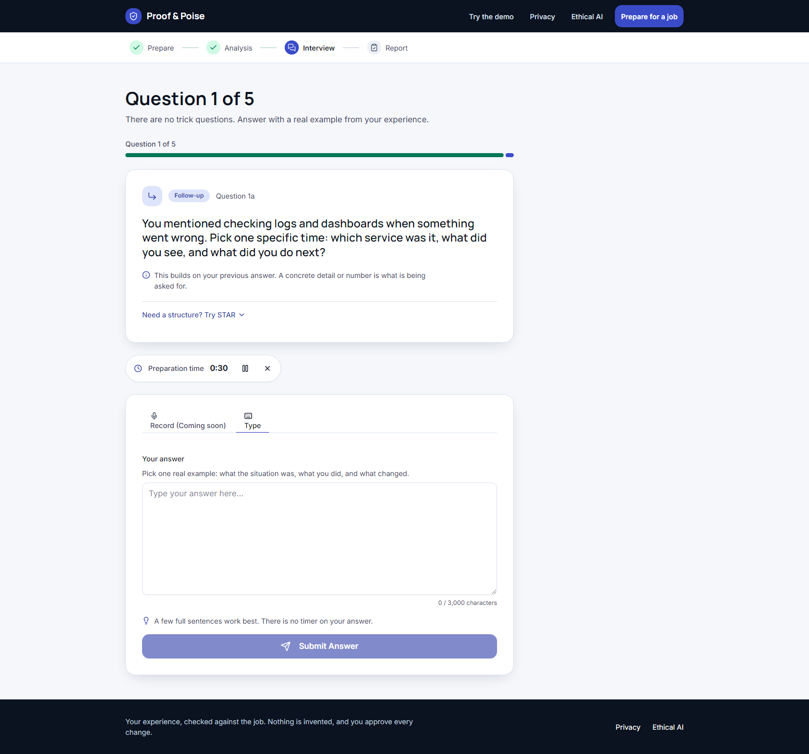
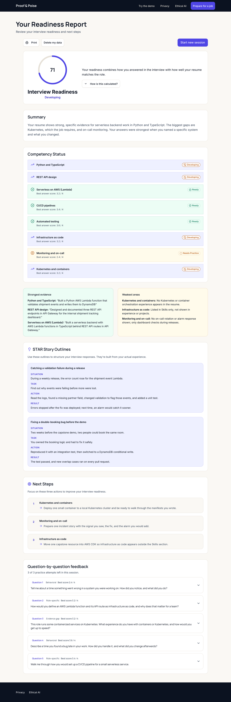
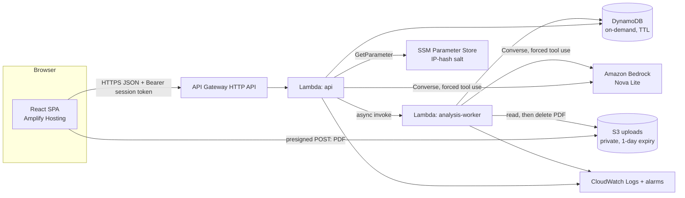

# Proof & Poise

Your experience is stronger when you can prove it.

Proof & Poise is an evidence-grounded resume tailoring and interview prep web app. You give it a resume and a job description. It maps each job requirement to verbatim lines from your resume, helps you tailor the resume using only what you can prove, and then runs a five-question mock interview aimed at your weakest evidence.

**[Try the demo](https://main.d1tn5k7jq2sjsu.amplifyapp.com/demo)** (fictional candidate, no resume needed) · **[Live app](https://main.d1tn5k7jq2sjsu.amplifyapp.com)** · **[Docs](#documentation)**

No account is needed. Each visit is an anonymous session, and its data expires after 24 hours.



## How to use it

The app has two steps: tailor your resume, then practice the interview. The top navigation tracks where you are: Prepare → Analysis → Interview → Report.

### 1. Start

On the home page, choose **Prepare for a job** to use your own resume, or **Try the demo** to walk through a fictional example first.

### 2. Add your resume and the job

**Prepare for a job** has three steps.

1. **Resume.** Choose **Upload PDF** (drag and drop or **Choose PDF file**) or **Paste text**.
   - PDF: up to 5 MB and 4 pages. It must contain selectable text; scanned PDFs can't be read, and the app offers **Paste text instead**.
   - Pasted text: 200 to 12,000 characters.
2. **Target job.** Paste the **Job description** (200 to 8,000 characters), enter the **Target role**, optionally the **Company**, and pick an **Interview type**: Behavioral and role-specific (recommended), Technical and behavioral, or Behavioral only.
3. **Review.** Check the summary and choose **Start analysis**. Analysis runs in the background, and the page updates when it's ready.

### 3. Read the analysis

The Overview tab opens with a plain verdict ("Your resume already proves N of M requirements"), your strongest proof, your biggest gap, and four scores:

| Score             | What it measures                     |
| ----------------- | ------------------------------------ |
| Job Match         | Alignment with the job requirements  |
| Evidence Coverage | Requirements your resume backs up    |
| Keyword Match     | Required job keywords found          |
| Parseability      | How readable your resume is to tools |

The **Competencies** tab lists each requirement (grouped as Required, Preferred, Contextual) with the resume lines that support it and an evidence label:

| Label             | Meaning                                                                                                 |
| ----------------- | ------------------------------------------------------------------------------------------------------- |
| Strong evidence   | At least two resume lines show it. One Education line is enough for a degree or certification.          |
| Moderate evidence | One resume line shows it, or you confirmed it yourself (see below).                                     |
| Weak evidence     | Listed in Skills only, with no example of using it.                                                     |
| No evidence       | Nothing in the resume shows it yet. That may mean it's missing from the document, not that you lack it. |

The **Keywords** tab shows which job keywords were found in your resume and which weren't.



### 4. Tailor your resume

Choose **Tailor my resume** on the Overview tab. Everything here uses only what your resume or your own confirmations show.

- **Accept or reject suggestions.** The **Recommendations** tab shows each suggested change with the Original and Suggested wording and a label for where its support comes from. Accept or reject them one at a time; nothing changes until you accept, and **Undo** works until the interview starts. Rewording never raises Job Match; only evidence does.
- **List proven keywords in Skills.** The **Tailor resume** tab lists job keywords your resume already shows but your Skills section doesn't list. Choose **Add to Skills** for each, or **Add all**. These are kept in the browser only, so a page reload clears them.
- **Confirm real experience.** Keywords and requirements your resume doesn't show are never added for you. If you really have the experience, choose **I have this experience**, describe it in your own words (30 to 500 characters), tick "This describes my real experience.", and **Save confirmation**. A session allows 3 confirmations, and each counts as Moderate evidence at most.
- **Watch the scores.** The Tailor resume tab shows Job match, Keyword match, and Evidence coverage at analysis → now.
- **Get the tailored resume.** The **Resume** tab shows your resume with changed lines marked "Changed". Choose **Copy as text** or **Download .txt**, or under "Download a formatted resume" pick a style (**Your original order** or **Jake's Resume style**) and choose **Download .docx** or **Download .pdf**. Files are built in your browser from the same text, with no model call, and a check refuses to export anything that adds, drops, or rewords a line.

Missing-evidence cards offer a confirmation instead of Accept. Their "Practice this in the interview" button is marked Coming soon.



### 5. Practice the interview

Choose **Start Interview**. You get five questions in this order: behavioral, role-specific, evidence gap, behavioral, role-specific. The evidence-gap question targets your weakest required competency.

- An optional 30-second **Preparation time** timer can be paused or hidden. It never submits for you, and there's no timer on the answer itself.
- Type your answer on the **Type** tab (20 to 3,000 characters) and choose **Submit Answer**. The **Record** tab shows "Record (Coming soon)": answers are typed in this version.
- If an answer is vague, you get a follow-up question.
- After each answer, **Answer feedback** shows a strength, an improvement, dimension scores, and an outline of a stronger answer. Choose **Continue to next question**, and after the last one, **View your report**.



### 6. Read your readiness report

**Your Readiness Report** shows:

- **Interview Readiness** = 70% interview performance + 30% resume match to the job (Job Match). Both terms are shown with their weights; **How is this calculated?** opens the details.
- A summary, your strongest evidence, and your weakest areas.
- **Next Steps**: three prioritized actions.
- STAR outlines, a competency status list, and question-by-question feedback.

From the report you can choose **Practice this question again** on any question below Proficient (3 practice attempts per session), **Print**, **Delete my data**, or **Start new session**.



## Try the demo

The [demo](https://main.d1tn5k7jq2sjsu.amplifyapp.com/demo) runs the full journey with a fictional candidate, "Amara Okonkwo (fictional)", applying for "Cloud Software Engineer I" at "Northwind Cloud (fictional company)". You don't upload anything personal. The demo uses a precomputed analysis and labeled sample interview feedback, makes no model calls, and shows every evidence level, a follow-up question, and the tailoring flow. A five-minute walkthrough is in [docs/12-demo-guide.md](docs/12-demo-guide.md).

## How it works

The model writes language; code decides.

- **Amazon Bedrock (Nova Lite)** generates competencies, evidence quotes, suggested wording, interview questions, and feedback through the Converse API with forced tool use.
- **Schema validation.** Zod checks the structure of every model output before it's used.
- **Grounding.** Every kept resume quote must appear in the resume, and suggestions can't add new numbers or terms.
- **Deterministic rules.** Evidence-strength caps, all scores, follow-up decisions, and quotas are TypeScript in `packages/shared`, tested with fast-check property tests.

Scores describe alignment and preparation within this app's rubric. They aren't an employer's ATS score and don't predict a hiring decision. More in [docs/02-originality.md](docs/02-originality.md).

## Architecture

All AWS resources are defined in one CDK stack (`ProofAndPoise-<stage>`, stages `dev` and `prod`) in `us-east-1`.



| Service                        | Role                                                                                     |
| ------------------------------ | ---------------------------------------------------------------------------------------- |
| Amazon API Gateway (HTTP API)  | Public `/v1/*` API with throttling and a CORS allowlist                                  |
| AWS Lambda (Node.js 22, arm64) | `api` for all routes; `analysis-worker` for PDF extraction, analysis, grounding, scoring |
| Amazon Bedrock (Nova Lite)     | Language generation only                                                                 |
| Amazon DynamoDB                | Session data, on-demand, 24 h TTL                                                        |
| Amazon S3                      | Private, short-lived uploads with a 1-day expiry                                         |
| AWS Systems Manager            | Parameter Store holds the IP-hash salt                                                   |
| Amazon CloudWatch              | Allowlisted logs and error alarms                                                        |
| AWS Amplify Hosting            | Hosts the web app (`main` = production, `develop` = preview)                             |
| AWS Budgets                    | Spend alerts                                                                             |

Amazon Transcribe for recorded answers is built and deployed but switched off, because the account isn't subscribed to it. There's no VPC, NAT gateway, always-on compute, RDS, or vector database. Details: [architecture](docs/03-architecture.md), [AWS services](docs/04-aws-services.md), [cost controls](docs/08-cost-controls.md).

## Privacy and limits

- **What's stored.** Resume and job text, the analysis, interview answers, and the report, for 24 hours (DynamoDB TTL). An uploaded PDF is deleted right after text extraction, with a 1-day S3 expiry as a backstop. Your IP is never stored, only a salted hash in a short-lived rate-limit counter.
- **Delete my data** removes the session's records and files immediately, and the session token stops working. The token lives in `sessionStorage`, so closing the tab drops it.
- **Logs** contain allowlisted fields only, never resume text, answers, or tokens.

Known limitations:

- Answers are typed only; recorded answers are off.
- PDF upload works for text-based PDFs up to 4 pages. Scanned PDFs need pasted text.
- Exports are `.txt`, `.docx`, and `.pdf` built from the resume text, so they can't copy your original PDF's design.
- English only. No accounts or saved history.
- Analysis quality from the model varies between runs.
- Each session allows 2 analyses and 2 report builds.

See [known limitations](docs/09-limitations.md) and [security and privacy](docs/07-security-privacy.md).

## Run locally

Requires Node 22 (`.nvmrc`) and pnpm 10.34.5. Don't use npm or yarn.

Try it without AWS. The MSW mock API answers every request from the fictional demo fixture:

```sh
pnpm install --frozen-lockfile
pnpm --filter @proof-and-poise/web dev:mock
```

Then open http://localhost:5173/demo. In mock mode every analysis returns the demo map, whatever you submit.

Checks, in CI order:

```sh
pnpm typecheck
pnpm lint
pnpm test
pnpm build
```

Web dev server against a real API: `pnpm --filter @proof-and-poise/web dev`, with `VITE_API_BASE_URL` in `apps/web/.env.local` (template: `.env.example`). E2E against the mock API: `pnpm --filter @proof-and-poise/web e2e`.

### Deploy

Deploys change AWS resources and need the account owner's explicit authorization. Full steps: [docs/11-deploy-and-teardown.md](docs/11-deploy-and-teardown.md).

```sh
export AWS_PROFILE=<your-profile> AWS_REGION=us-east-1
pnpm --filter @proof-and-poise/infrastructure run cdk bootstrap            # once per account/region
pnpm --filter @proof-and-poise/infrastructure run cdk diff --context stage=dev
pnpm --filter @proof-and-poise/infrastructure run cdk deploy --context stage=dev
aws cloudformation describe-stacks --stack-name ProofAndPoise-dev \
  --query "Stacks[0].Outputs[?OutputKey=='ApiUrl'].OutputValue" --output text
```

Set that URL as `VITE_API_BASE_URL` for the web app (locally in `apps/web/.env.local`, or in the Amplify branch environment), and add the web origin to `proof-and-poise:allowedOrigins` in `infrastructure/cdk.json`.

### Teardown

Deletes the stage's table, bucket, objects, logs, and salt parameter. It can't be undone; get explicit authorization first.

```sh
pnpm --filter @proof-and-poise/infrastructure run cdk destroy --context stage=<stage>
```

Then delete the Amplify app in the Amplify console. Details: [docs/11-deploy-and-teardown.md](docs/11-deploy-and-teardown.md#teardown).

## Repository

| Path              | Contents                                                                                          |
| ----------------- | ------------------------------------------------------------------------------------------------- |
| `apps/web`        | React 19 SPA (Vite, Tailwind CSS 4, Radix UI, TanStack Query), MSW mocks, Playwright e2e with axe |
| `packages/shared` | Zod schemas, API contracts, scoring, grounding, interview rules, tailoring, limits, demo fixture  |
| `services/api`    | Lambda handlers, routes, services, Bedrock client, prompt evaluator                               |
| `infrastructure`  | CDK app (`ProofAndPoise-<stage>`) and assertion tests                                             |
| `.kiro`           | Spec (requirements, design, tasks), steering, skills, hooks                                       |
| `docs`            | Documentation set below                                                                           |

## Documentation

1. [Problem and users](docs/01-problem-and-users.md)
2. [Originality](docs/02-originality.md)
3. [Architecture](docs/03-architecture.md) (Mermaid diagram)
4. [AWS services](docs/04-aws-services.md)
5. [Kiro and the Agent Toolkit for AWS](docs/05-kiro-and-agent-toolkit.md)
6. [Timeline](docs/06-timeline.md)
7. [Security and privacy](docs/07-security-privacy.md)
8. [Cost controls](docs/08-cost-controls.md)
9. [Known limitations](docs/09-limitations.md)
10. [React Native plan](docs/10-react-native-plan.md)
11. [Deploy and teardown](docs/11-deploy-and-teardown.md)
12. [Demo guide](docs/12-demo-guide.md)
13. [Judging map](docs/13-judging-map.md)
14. [Submission story](docs/14-submission-story.md)

Also: [analysis prompt evaluation](docs/analysis-prompt-evaluation.md), [Amplify hosting](docs/amplify-hosting.md), [screenshots](docs/screenshots/README.md), and [HANDOFF.md](HANDOFF.md).

## Team

Built by Ali Furkan Karaman and Kevin Vargas for the AWS "Zero to Shipped" Shipathon (September 27 to October 2, 2026). We worked spec-first in Kiro: requirements, design, and 25 implementation tasks in `.kiro/specs/proof-and-poise/`, with steering files, skills, and hooks keeping agent sessions consistent. See [docs/05-kiro-and-agent-toolkit.md](docs/05-kiro-and-agent-toolkit.md).

The tailored-resume layout is inspired by [Jake's Resume](https://github.com/jakegut/resume) (MIT). PDF font: Crimson Text (SIL OFL 1.1, `apps/web/src/assets/fonts/crimson-text/OFL.txt`).

## License

MIT. See [LICENSE](LICENSE).
