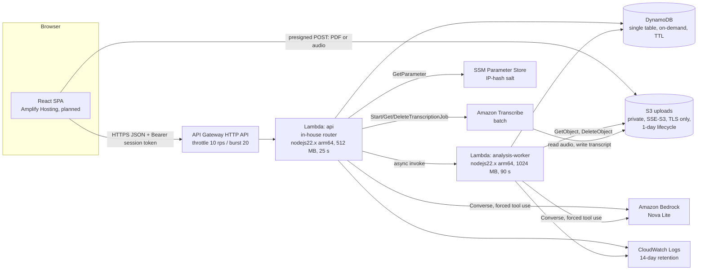

# 03. Architecture

A React single-page app talks to a small serverless API in `us-east-1`. All AWS resources are defined in one CDK stack, `infrastructure/lib/proof-and-poise-stack.ts` (`ProofAndPoise-<stage>`, stages `dev` and `prod`).

## Packages

| Package           | Role                                                                                                              |
| ----------------- | ----------------------------------------------------------------------------------------------------------------- |
| `apps/web`        | React 19, Vite, Tailwind CSS 4, Radix UI, TanStack Query, React Hook Form. MSW mocks for dev and e2e.             |
| `packages/shared` | Pure TypeScript: Zod schemas, route contracts, scoring, grounding, interview rules, limits, demo fixture.         |
| `services/api`    | Lambda handlers (`handlers/api.ts`, `handlers/analysisWorker.ts`), routes, services, Bedrock client, data access. |
| `infrastructure`  | AWS CDK app and stack, plus CDK assertion tests.                                                                  |

`packages/shared` is consumed as TypeScript source by Vite and by the CDK `NodejsFunction` (esbuild) bundles, so the web app and the API validate with the same schemas.

## Request flow

1. `POST /v1/sessions` creates an anonymous session and returns a bearer token. Only the token hash is stored.
2. The browser uploads a PDF with a presigned POST (PDF only, ≤ 5 MB, 300 s expiry), or pastes text.
3. `POST /v1/sessions/{id}/analysis` returns 202 and invokes the worker asynchronously. Analysis can exceed the 30 s HTTP API integration limit, so it runs outside the request.
4. The worker extracts text with `unpdf` (≤ 4 pages), deletes the PDF, calls Bedrock, applies grounding filters and strength caps, computes scores, and stores the Evidence Map.
5. The browser polls `GET …/analysis` until it's `ready` or `failed`.
6. Interview, answers, transcription, report, and practice are synchronous API calls, each bounded under the 25 s Lambda timeout by per-task token caps and timeouts (`LIMITS.model`, `LIMITS.interview.modelTimeoutSec`).
7. Transcription is polled lazily. When `GET …/transcription` finds the job complete, it reads the transcript and deletes the audio, the transcript, and the job (design §2).

The full route list is in `packages/shared/src/contracts/routes.ts` and design §8.

## Data model

One DynamoDB table, `PK`/`SK`, TTL attribute `ttl` (design §5):

| PK                       | SK                                                 | Content                                             |
| ------------------------ | -------------------------------------------------- | --------------------------------------------------- |
| `S#<sessionId>`          | `META`, `INPUT`, `ANALYSIS`, `TURN#<nn>`, `REPORT` | Session state, 24 h TTL                             |
| `IP#<hash>#<yyyymmddhh>` | `RATE`                                             | Session-creation counter, 2 h TTL                   |
| `GLOBAL#<yyyymmdd>`      | `BUDGET`                                           | Daily Bedrock calls and Transcribe seconds, 3 d TTL |

## Design choices

- No VPC and no NAT: every service is reached through public AWS endpoints with IAM.
- Two Lambdas only. No queues, Step Functions, or EventBridge rules.
- Worker async retries are off (`retryAttempts: 0`). A lost run is reported as failed after 120 s so the client can retry (`LIMITS.analysis.staleAfterSec`).
- The AWS SDK is bundled at a pinned version (`externalModules: []`) instead of relying on the Lambda runtime copy.
