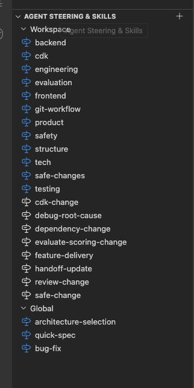
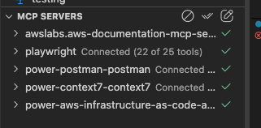
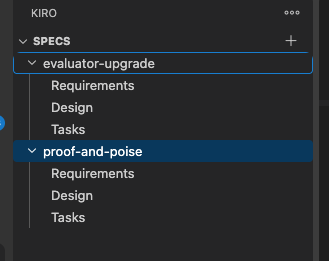
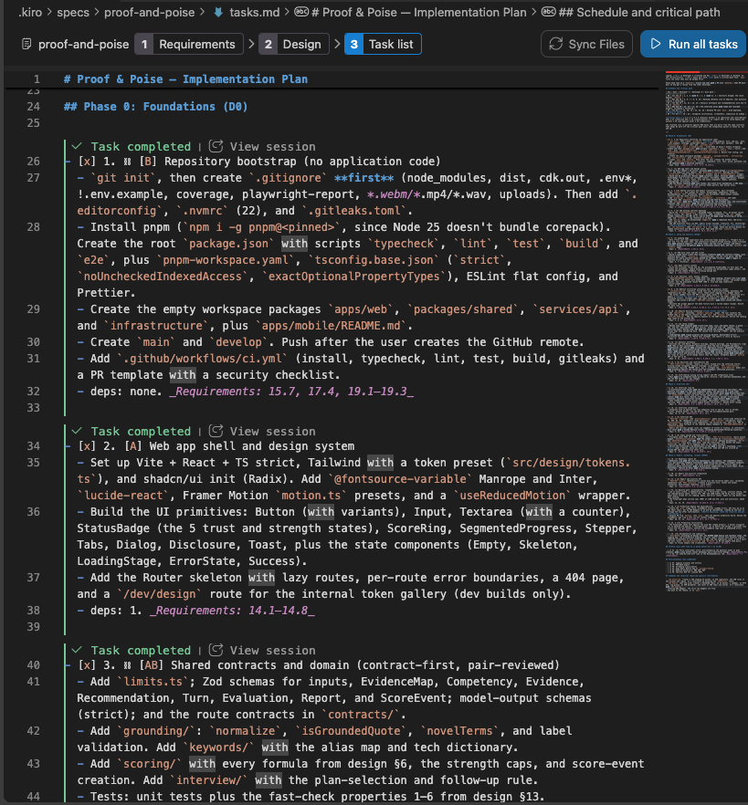

# 05. Kiro and the Agent Toolkit for AWS

Proof & Poise was built spec-first in Kiro by two developers in about five days. Everything below is in the repo except where marked `TODO(user)`.

## Spec-driven workflow

The spec lives in `.kiro/specs/proof-and-poise/`:

- `requirements.md`: 19 numbered MVP requirements with acceptance criteria, assumptions, and a post-hackathon list.
- `design.md`: architecture, domain model, storage, scoring formulas, AI integration, API contract, design system, security, cost model, and the six correctness properties.
- `tasks.md`: 25 tasks with owners ([A] frontend, [B] backend, [AB] pair), dependencies, a critical path, and the requirements each task covers.

Each task ran on its own `feature/*` branch and merged into `develop` through a PR with CI. Code cites the requirement or design section it enforces (for example `// Req 16.4`, `(design §7.4)`), so a reviewer can trace behavior back to the spec.

Design §13 lists six correctness properties. Each is a `fast-check` property test in `packages/shared/src/properties.test.ts`: score bounds, monotonicity, follow-ups can't lower a score, grounded recommendations add no new numbers, rewording-only never changes Job Match, and the follow-up rule always gives 1–2 follow-ups.

## Steering

`.kiro/steering/` holds the rules every agent session loads:

| File                                  | Covers                                                                                                        |
| ------------------------------------- | ------------------------------------------------------------------------------------------------------------- |
| `product.md`                          | Purpose, users, core invariant, current scope                                                                 |
| `tech.md`                             | Pinned versions and commands                                                                                  |
| `structure.md`                        | Repository layout, where new code goes, dependency boundaries                                                 |
| `engineering.md`                      | Code, testing, error, and accessibility conventions                                                           |
| `safety.md`                           | Preserve uncommitted work, no destructive commands, no deploys or billable calls without approval, no secrets |
| `git-workflow.md`                     | Commit and push to `feature/*` after verification; never push to `develop` or `main`                          |
| `frontend.md`, `backend.md`, `cdk.md` | Area-specific guidance for `apps/web`, `services/api`, and `infrastructure`                                   |
| `evaluation.md`                       | Rules for scoring, grounding, keyword, tailoring, and evaluator changes                                       |
| `testing.md`                          | Which checks to run for each kind of change, and how to report what was verified                              |
| `safe-changes.md`                     | Risk-report format before deletes, dependency changes, CDK or AWS commands, billable calls, and pushes        |

## Skills

`.kiro/skills/` packages repeatable procedures:

- `cdk-change`: test and synth locally, review the diff, and never deploy or destroy without explicit authorization.
- `dependency-change`: one pinned change per package with pnpm, then review the manifest and lockfile diff.
- `feature-delivery`: contract-first plan (shared contract → API route → web feature → CDK wiring).
- `handoff-update`: keep `HANDOFF.md` current after each merge into `develop`.
- `safe-change`: narrow edits that preserve user work and end with a verified report.
- `debug-root-cause`: reproduce a failure with the narrowest command, trace it to a cause with file and line evidence, then fix it with a regression test.
- `evaluate-scoring-change`: after a scoring, grounding, tailoring, or prompt change, run the offline evaluator and property tests and report fixture gaps instead of claiming a pass.
- `review-change`: read-only review of a diff or PR for correctness, contract compatibility, error handling, and sensitive-data exposure.

## Hooks

Two hooks live in `.kiro/hooks/` (added on 2026-10-02 in PR #38). Both run read-only scripts from `.kiro/scripts/`:

- `lint-changed-file.json` (on file save): after the agent saves a TypeScript source file in `apps/web`, `packages/shared`, `services/api`, or `infrastructure`, it runs ESLint and `prettier --check` on that one file. It never writes, so it can't retrigger itself.
- `eval-regression.json` (after a spec task runs): if evaluator, scoring, grounding, keyword, or tailoring files changed on the branch, it runs the offline evaluator and those test suites; otherwise it skips. It never calls Bedrock.

## MCP servers

No MCP configuration is committed to the repo. The screenshot below (2026-10-02) shows these five servers connected in the owner's Kiro. The repo doesn't record which task used which server, so the uses below are the typical ones, not a log.

- `awslabs.aws-iac-mcp-server` (Kiro Power "aws-infrastructure-as-code"): CDK documentation, CloudFormation template validation, cfn-lint, and cfn-guard. Likely used for the CDK stack in `infrastructure/` (tasks 4, 8, 23).
- `awslabs.aws-documentation-mcp-server`: AWS documentation lookups, for example Bedrock Converse and Nova Lite limits, Lambda quotas, and Transcribe subscription errors.
- `playwright`: browser checks of the UI, alongside the committed Playwright e2e and accessibility specs in `apps/web/e2e/`.
- `context7`: current library documentation (for example React Router, TanStack Query, Zod, Vitest).
- `postman`: installed; no API collection is committed.

These five are the full list. Earlier drafts named an "Agent Toolkit for AWS MCP server"; that wasn't one of them.

## How Kiro and AWS gates worked together

The steering made AWS actions explicit decisions. `cdk bootstrap`, `cdk deploy`, and billable Bedrock or Transcribe calls each needed a stated resource list and a yes from the account owner (`safety.md`, `cdk-change`). Examples from the history:

- Task 4 deployed the walking skeleton to `dev` only after the resources were listed and approved.
- The live analysis prompt evaluation (task 9) stayed "not run yet" until billable calls were authorized. See [analysis-prompt-evaluation.md](analysis-prompt-evaluation.md).
- Task 18's real Transcribe check never ran: the account isn't subscribed to Amazon Transcribe, so recorded answers are switched off (`FEATURES.recordedAnswers`).

## Screenshots

Redact account IDs, ARNs, API IDs, bucket names, URLs, and personal data before committing (Req 18.3). Store them in [screenshots/](screenshots/README.md).

