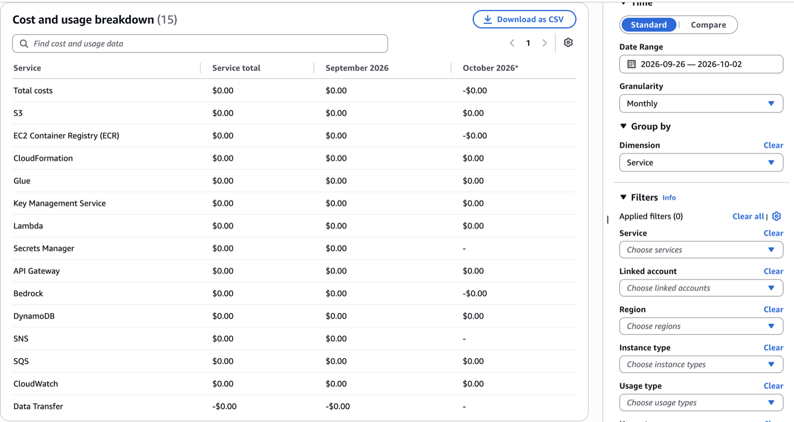

# 08. Cost controls

Target: under $10 of AWS spend for the whole hackathon (requirements.md). Nothing in the stack runs or bills while idle except storage measured in kilobytes and log retention.

## Controls in code and infrastructure

| Control                      | Value                                                                                                         | Where                                                    |
| ---------------------------- | ------------------------------------------------------------------------------------------------------------- | -------------------------------------------------------- |
| API stage throttling         | 10 req/s, burst 20                                                                                            | `API_THROTTLE` in the stack (Req 16.1)                   |
| Per-session quotas           | 2 analyses, 3 confirmations, 10 evaluations (5 primary, 2 follow-up, 3 practice), 2 reports, 8 transcriptions | `LIMITS.quotas`, DynamoDB conditional updates (Req 16.2) |
| Session creation rate limit  | 10 per salted IP hash per hour                                                                                | `LIMITS.rateLimit` (Req 16.3)                            |
| Global daily circuit breaker | 1,500 Bedrock calls and 60 min of Transcribe audio per day; returns 503 `CAPACITY_REACHED`                    | `LIMITS.globalBudget` (Req 16.4)                         |
| Output token caps            | analyze 5,000; questions 1,000; evaluation 800; confirmation rewrite 400; report 1,200                        | `LIMITS.model` (Req 16.5)                                |
| Recording length             | 120 s per answer                                                                                              | `LIMITS.recording`                                       |
| No always-on resources       | No VPC, NAT, provisioned throughput, RDS, OpenSearch, ECS/EKS, WAF, vector DB                                 | Stack; asserted in `stack.test.ts` (Req 16.6)            |
| Short retention              | 24 h session TTL, 1-day S3 lifecycle, 14-day logs, PITR off                                                   | Stack, `LIMITS.session`                                  |

The caps are constants in `packages/shared/src/limits.ts`. Changing one needs a code change and a redeploy; design §12 mentions an SSM-tunable Transcribe cap, but that isn't implemented.

## Estimate (design §12)

Transcribe is the only meaningful cost: about $0.024 per minute, so the 60-minute daily cap bounds it at about $1.44 per day. Bedrock Nova Lite is fractions of a cent per session. Lambda, API Gateway, DynamoDB, S3, and CloudWatch stay within cents at hackathon traffic. These are estimates from public price lists; confirm current prices on the [Bedrock pricing page](https://aws.amazon.com/bedrock/pricing/) and the [Transcribe pricing page](https://aws.amazon.com/transcribe/pricing/).

## Actual spend

Total: **$0.00**. Read in Cost Explorer on 2026-10-02 for 2026-09-26 to 2026-10-02, monthly, grouped by service, with no filters. All 15 services in the breakdown (including Bedrock, Lambda, API Gateway, DynamoDB, S3, SQS, SNS, CloudWatch, and ECR) round to $0.00. A few show "-$0.00", which means a credit or adjustment smaller than half a cent.



All stack resources carry the tags `app=proof-and-poise` and `stage=<stage>`. To filter by them in Cost Explorer, activate them as cost allocation tags in the Billing console first.

## AWS Budgets setup

Status: created through the CLI in task 23 (2026-10-01): `proof-and-poise-5usd` and `proof-and-poise-8usd`. The first two budgets in an account are free.

Console steps:

1. Billing and Cost Management → Budgets → Create budget → Customize → Cost budget, monthly.
2. Budget `proof-and-poise-5usd`: amount $5, alerts at 80% of actual and 100% of forecasted cost, email the team.
3. Budget `proof-and-poise-8usd`: amount $8, same two alerts.

CLI alternative (replace the placeholders; get the account ID with `aws sts get-caller-identity --query Account --output text` and don't commit it):

```sh
aws budgets create-budget --account-id <account-id> \
  --budget '{"BudgetName":"proof-and-poise-5usd","BudgetLimit":{"Amount":"5","Unit":"USD"},"TimeUnit":"MONTHLY","BudgetType":"COST"}' \
  --notifications-with-subscribers '[{"Notification":{"NotificationType":"ACTUAL","ComparisonOperator":"GREATER_THAN","Threshold":80,"ThresholdType":"PERCENTAGE"},"Subscribers":[{"SubscriptionType":"EMAIL","Address":"<team-email>"}]},{"Notification":{"NotificationType":"FORECASTED","ComparisonOperator":"GREATER_THAN","Threshold":100,"ThresholdType":"PERCENTAGE"},"Subscribers":[{"SubscriptionType":"EMAIL","Address":"<team-email>"}]}]'
```

Repeat with `proof-and-poise-8usd` and `"Amount":"8"`.

CloudWatch alarms (Lambda errors, API 5xx) also email through the stage's SNS topic; see [11-deploy-and-teardown.md](11-deploy-and-teardown.md#deploy-the-backend).

## At $10

If spend reaches $10, stop: point the demo at the fictional fixture with typed answers only, and tear down the stacks with [11-deploy-and-teardown.md](11-deploy-and-teardown.md#teardown) (needs explicit authorization; it deletes all data). Budgets alert by email; they don't stop resources unless a Budget action is configured, and none is.
