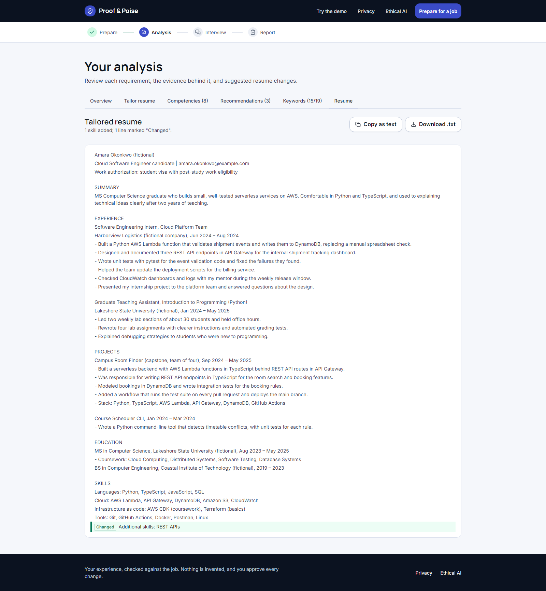
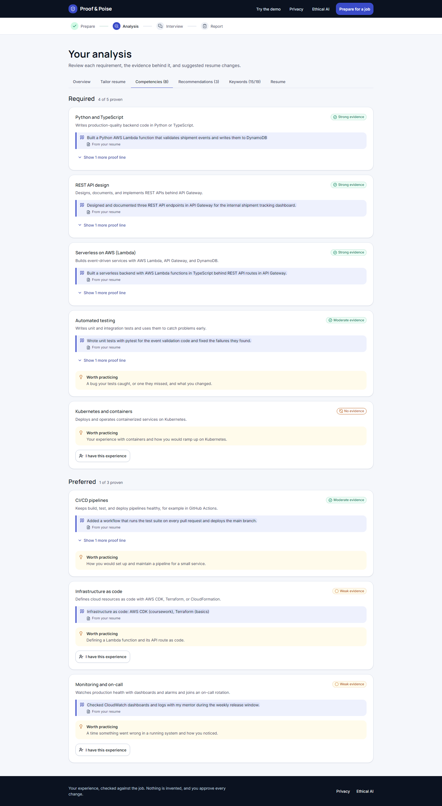

# 14. Submission story

> "Your experience is stronger when you can prove it."

## The problem

A new graduate on a student visa has a cloud internship, a serverless capstone, and a semester as a teaching assistant. She applies for an entry-level cloud role. A resume tool rewrites her bullets with metrics she never measured and a Kubernetes mention she can't defend. A mock-interview tool asks her "Tell me about yourself." Neither one tells her where her evidence is thin, or why her score is what it is.

## What we built

Proof & Poise starts from what the candidate can prove. It maps the job's competencies to verbatim lines from her resume, and shows which are strong, which are weak (listed in Skills only), and which are missing. Step 1 is tailoring her resume to the job, truthfully. It suggests changes she approves one at a time, each labeled by where its support comes from, and it never adds a number or a technology she didn't write. Job keywords her resume already proves can go into her Skills line with one click; keywords it doesn't show are never added, only confirmed if she has the experience. She copies the tailored resume or downloads it as text. Step 2 interviews her on the weakest evidence, asks a follow-up when an answer is vague, and gives a readiness report where every number has a formula behind it.

## How it works

The model writes language; code decides. Amazon Bedrock (Nova Lite) produces competencies, quotes, questions, and feedback through forced tool use. Every output is schema-validated, and every quote must be found in the resume before it's kept. Scores, strength caps, follow-up decisions, and quotas live in a shared TypeScript package with property tests. The backend is two Lambdas, one DynamoDB table, and a private S3 bucket that forgets uploads within a day. Recorded answers through Amazon Transcribe are built but switched off, because the hackathon account isn't subscribed to Transcribe; answers are typed. No accounts, no always-on servers, and daily caps keep spend in single dollars.

## How we built it

Two developers, five days, spec-first in Kiro. Requirements, design, and 25 tasks came first. Steering files kept every agent session inside the same rules: preserve uncommitted work, never deploy or make billable calls without a yes, never commit secrets. Skills turned CDK changes, dependency changes, and handoffs into repeatable procedures. The frontend ran on mocks built from the same contracts as the API, so both halves moved in parallel.

## What we learned

The model is good at language and unreliable at judgment. Our live prompt evaluation showed results that vary between runs on the same fictional cases, which is why grounding and caps run in code rather than in the prompt. We report those numbers as they are ([analysis-prompt-evaluation.md](analysis-prompt-evaluation.md)).

## What's next

Accounts and history, DOCX and PDF resume export, recorded answers once Transcribe is enabled, an interviewer voice, and a mobile app on the same shared package ([10-react-native-plan.md](10-react-native-plan.md)).

## Screenshots

More in the [demo guide](12-demo-guide.md#screenshots).

## Links

- Hosted app: https://main.d1tn5k7jq2sjsu.amplifyapp.com
- Team: `TODO(user): team member names.`
- Demo video: `TODO(user): demo video link.`
- AWS spend: $0.00 in Cost Explorer for 2026-09-26 to 2026-10-02, read on 2026-10-02 (details in [08-cost-controls.md](08-cost-controls.md)).
